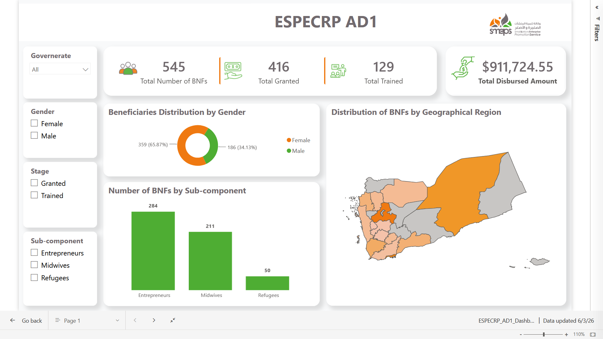

# 📊 Project Performance & KPI Monitoring Dashboard

### Turning CRM-based project data into a practical monitoring and decision-support tool.

<p align="center">
  
</p>

> **Professional Work — SMEPS**  
> **Confidential Project | Sanitized Portfolio Case Study**

This project documents a Power BI dashboard I developed during my professional work at **SMEPS** to support monitoring of a specific entrepreneurship project.

The dashboard transformed operational CRM data into an interactive view of key project indicators, beneficiary distribution, grant activity, geographic coverage, and implementation stages.

Because the underlying CRM data is confidential, this repository contains **no source data, PBIX file, CRM exports, or personally identifiable information**. The screenshot is provided only as a visual reference to demonstrate the type of solution delivered.

---

## 🎯 Business Problem

The project involved monitoring a large portfolio of beneficiaries across multiple components, regions, and implementation stages.

The existing reporting process made it difficult to quickly answer important monitoring questions such as:

- How many beneficiaries are currently represented in the project?
- How many have received grants or training?
- How are beneficiaries distributed geographically?
- What is the gender distribution?
- How are beneficiaries distributed across project sub-components?
- What is the current level of grant disbursement?
- How do project indicators change when different segments are selected?

The objective was to create a centralized and interactive monitoring solution that could turn operational data into a clearer view of project performance.

---

## 💡 The Solution

I designed and developed an interactive **Power BI KPI monitoring dashboard** connected to project data maintained through the organization's CRM and Google Sheets workflow.

The solution combined data preparation, analytical modeling, DAX calculations, KPI development, and interactive visualization into a single reporting interface.

### Dashboard Areas

**Project KPIs**

- Total beneficiaries
- Grant status
- Training status
- Total disbursed amount

**Beneficiary Analysis**

- Gender distribution
- Beneficiary counts
- Project sub-component distribution

**Geographic Analysis**

- Beneficiary distribution by governorate
- Regional concentration and coverage

**Interactive Monitoring**

- Governorate filtering
- Gender filtering
- Implementation-stage filtering
- Sub-component filtering

---

## 🔄 Data & Analytics Workflow

```text
Organization CRM
       ↓
Google Sheets
       ↓
Power Query
       ↓
Data Model
       ↓
DAX Measures
       ↓
Power BI Dashboard
       ↓
Project Monitoring & Decision Support
```

The workflow allowed operational information to be transformed into a structured reporting layer that stakeholders could interact with without manually compiling recurring reports.

---

## 🧠 Analytical Approach

The project focused on translating operational requirements into meaningful monitoring metrics.

### KPI Development

I identified and structured the indicators most relevant to project monitoring, including beneficiary counts, grant activity, training status, and disbursement information.

### Segmentation

The dashboard enables stakeholders to examine the project through multiple dimensions:

- Geography
- Gender
- Project stage
- Sub-component

### Geographic Monitoring

Regional distribution was visualized to provide a quick view of where beneficiaries were concentrated and how project coverage was distributed geographically.

### Interactive Analysis

Slicers were designed to allow stakeholders to move from a high-level project view into specific beneficiary segments.

---

## 🛠️ Technical Stack

| Area | Technologies |
|---|---|
| Business Intelligence | Power BI |
| Data Preparation | Power Query |
| Analytics | DAX |
| Data Source / Workflow | Google Sheets, CRM Data |
| Visualization | Power BI Interactive Reports |

---

## 📈 Business Value

The dashboard moved project monitoring away from manually compiled reporting toward a centralized interactive view.

It provided stakeholders with:

- Faster access to critical project KPIs
- A consolidated view of project performance
- Easier geographic and demographic analysis
- More efficient monitoring of grant and training stages
- Interactive exploration of beneficiary segments
- A reusable reporting structure for recurring monitoring needs

The key value was not simply visualizing data, but **turning operational CRM information into a practical monitoring tool for project stakeholders**.

---

## 👤 My Contribution

As the Data Analyst, I contributed to the development of the reporting solution by:

- Translating project monitoring requirements into measurable KPIs
- Connecting Power BI with the available data workflow
- Preparing and transforming data using Power Query
- Developing analytical calculations using DAX
- Designing the dashboard structure and interactive filtering experience
- Converting operational data into a clear stakeholder-facing monitoring view

---

## 🔒 Confidentiality

This is a **sanitized case study of professional work**.

The original project data contains confidential organizational and beneficiary information. For that reason, this repository intentionally excludes:

- Source CRM data
- Google Sheets data
- PBIX files
- Beneficiary names
- Contact information
- Individual grant records
- Detailed financial records
- Internal project documentation

Only a dashboard preview and high-level description of the analytical solution are included.

See **[Confidentiality & Portfolio Usage](documentation/confidentiality.md)** for more information.

---

## 📚 Documentation

- **[Methodology](documentation/methodology.md)** — analytical approach, data workflow, KPI design, and dashboard development process.
- **[Confidentiality & Portfolio Usage](documentation/confidentiality.md)** — explains what has intentionally been excluded from the repository.

---

## 📁 Repository Structure

```text
project-performance-kpi-dashboard/
│
├── README.md
│
├── assets/
│   └── dashboard-preview.png
│
└── documentation/
    ├── methodology.md
    └── confidentiality.md
```

---

## 👤 About Me

I'm **Omar Alkhulaidi**, a Data Analyst focused on **Business & Operations Analytics**.

I build practical analytics solutions that turn operational data into structured insights, reliable KPIs, and clearer business decisions.

### Connect

[](https://www.linkedin.com/in/omar-alkhulaidi/)

[](https://github.com/Omar-Alkhulaidi)
